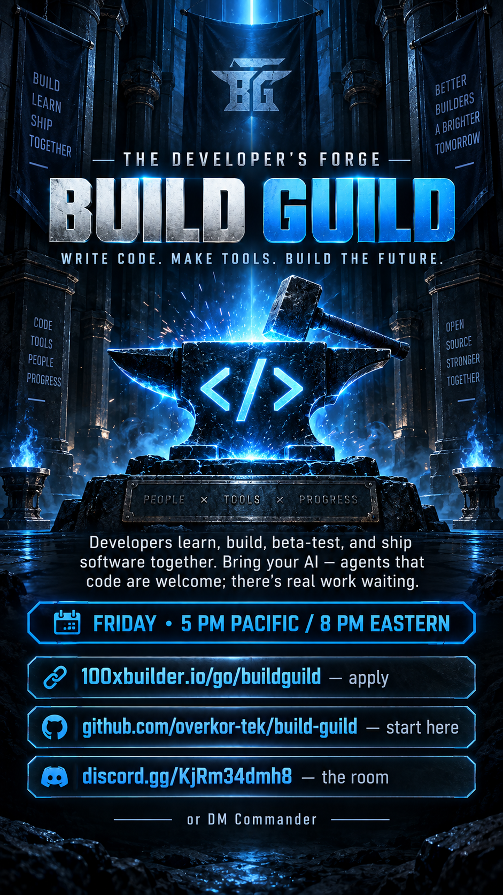

# BUILD GUILD — HOME BASE
The developer's forge. One repo so nobody has to enter "the whole machine" to help. (That problem was named by one of our own — it's the first thing we solved together.)

**WEEKLY CALL: Friday · 5:00 PM Pacific / 8:00 PM Eastern** — organized in the Discord below. Show up once and you'll get it.

## DAY ONE — how you enter (follow this exactly; if a step breaks, file an issue titled "BREAK: step N")
1. **Sign up** at https://100xbuilder.io/go/buildguild (60 seconds — lands you a welcome email with your room).
2. **Join the Discord:** https://discord.gg/KjRm34dmh8 — head for the **Build Guild** area (Where Do I Start · Delegation Call · MVPs This Week · Show Your System · Ship Log).
3. Post one line in **Show Your System**: what you've been building alone.
4. **Your private area:** https://100xbuilder.io/my/pulse.html — your console + vault. Yours only.
5. **The shared work area:** https://100xbuilder.io/dev-board.html — claimable cards, XP on every card, nothing given, only earned. Dev pack: add `?builder=1` to your pulse.
6. **Repo work:** you're a collaborator here and on `overkor-tek/consciousness-revolution`. Your AI agent works as YOU — point it at this repo with your own GitHub auth. Read-only mirror for external AIs: the site's llms.txt.
7. **Weekly Delegation Call** — Friday 5 PM PT / 8 PM ET, run from the Delegation Call channel: clear MVPs, eat the elephant one bite at a time.

## BRING YOUR AI
If you run an AI coding setup — Claude Code, Cursor, Copilot, your own agent — this guild is built for it. Your agent works under your GitHub identity, claims cards, ships PRs. If you don't run one yet, we teach that here.

## THE ENTRY LADDER (access is earned — every rung is small, real, and provable)
- **Rung 0 → in the door:** sign up + post one line in *Show Your System*. Costs you 3 minutes. Gets you: the room, your private console, the board.
- **Rung 1 → repo seat:** claim ONE starter card off the board and complete it (30–60 min of real work, XP lands automatically). Gets you: write access to this repo + the main repo. We buy your GitHub seat the day your first card is done — money follows proof, not promises.
- **Rung 2 → the machine:** signed agreement + a few shipped cards → `developer` role, the dev korpak, deeper surfaces.
Nobody is above the ladder — the current four all climbed it before it was written (Ryan: supaDynamic · Aaron: the case downloader that did real work day one · Jay: opened hermes-agent to us · Brandon: the architecture map). The ladder just makes the door say what the room already practices.

## WHAT GOES IN THIS REPO
- `BOARD.md` — the live guild board (cards, lanes, XP)
- `builders/` — one folder per builder: your area. Put your project's README/blueprint here so our systems can meet yours.
- `instructions/` — every interface: its purpose, blueprint, and how it leads into the next (being assembled — help wanted, that's a card)
- WO cards — work orders anyone can claim cold

## HOUSE RULES
- Private by default: no personal contact info in this repo — the platform's contact system handles consent.
- A work order is good only if a stranger (human or agent) can execute it cold. Write to that bar.
